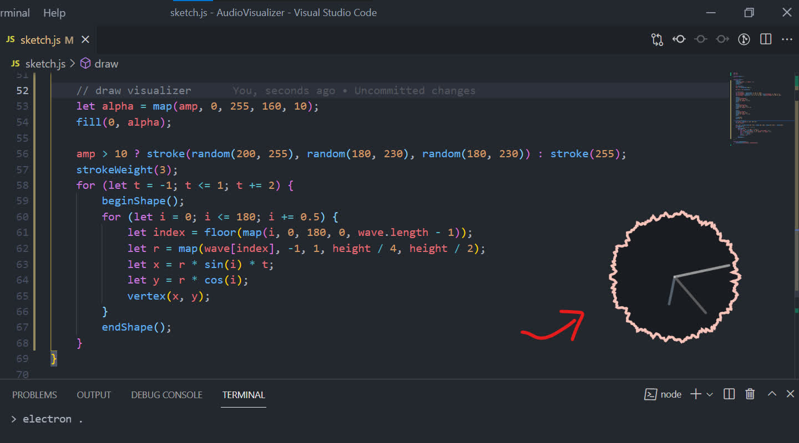

## Audio Visualizer

The goal of the project is to make a small desktop clock that can make a visual response
based on the frequency amplitude of the currently playing music.

## Install

You would need nodeJS to run these project ([download from their website](https://nodejs.org/en/))
Then run following commands:

`npm install`

`npm run build`

## Problem

Currently the project needs to enable Stereo Mix ([How to enable Stereo Mix in Win10](https://www.howtogeek.com/howto/39532/how-to-enable-stereo-mix-in-windows-7-to-record-audio/)) to get the speaker's audio.
I have searched for solutions but still cannot find how to get the speaker's audio in other way, if you have any idea please let me know, thanks.
